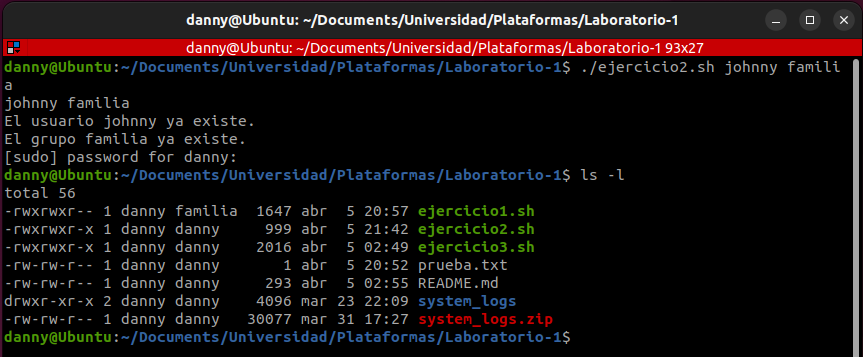

### Universidad de Costa Rica
#### IE0117 Programación Bajo Plataformas Abiertas
#### B93070 Daniela Fonseca Zumbado
---
# Laboratorio 1

## Introducción

Bash es el intérprete de comandos estándar para la mayoría de sistemas operativos que se encuentran basados en Unix o Linux. De hecho, corresponde al shell del proyecto GNU, el cual tiene un amplio uso hoy en día para ciertas funciones, como lo es por ejemplo la administración de sistemas [1].

A través de este reporte, se discutirá la implementación y los resultados obtenidos para tres ejercicios que permiten ilustrar la utilidad de las funciones con las que cuenta la herramienta de Bash.

## Implementación
### Scripting y Permisos

#### 1 - Interpretar permisos
Como primera parte del procedimiento, se creó un script de bash llamado `ejercicio1.sh`. Este script recibe como parámetro el nombre de un archivo. Al ejecutarse, verifica la existencia del archivo que recibió como parámetro. De ser lo contrario, se presenta un código de error al usuario.

Una vez confirmada la existencia del archivo, se ejecuta lo siguiente:
1. Se obtienen los permisos del archivo, y se almacenan dentro de una variable como un string.
2. Una vez obtenidos los permisos, ejecuta una función llamada `get_permissions_verbose`. Esta recibe como parámetro el string de permisos del archivo. Se encarga de:
> - Guardar los permisos en tres variables diferentes, para distinguir los de usuario, grupo y otros.
> - Interpretar estas variables como permisos read, write, execute o unknown.
> - Imprimir para usuario, grupo y otros, todos los permisos pertinentes identificados.

#### 2 - Limitar permisos
Adicionalmente, se creó otro archivo con el nombre de `ejercicio2.sh`. La finalidad principal de este archivo es de limitar los permisos de ejecución de otro archivo. Este archivo tiene las siguientes funciones:
1. Recibe dos strings, uno con un nombre de usuario y otro con un nombre de un grupo.
2. Intenta crear un nuevo usuario con el nombre proporcionado. En caso de que ya exista, informa de esto, pero continúa con el procedimiento.
3. Intenta crear un nuevo grupo con el nombre proporcionado. En caso de que ya exista, también informa de esto, pero continúa con el procedimiento.
4. Agrega el usuario al grupo ingresados. Adicionalmente, agrega al usuario default al grupo ingresado.
5. Asigna permisos de ejecución al script `ejercicio1.sh` para todos los miembros del grupo ingresado.

### 3 - Bash scripting

Para este último script `ejercicio3.sh`, el objetivo es que, después de ejecutar el archivo, el sistema le solicite al usuario que ingrese los comandos que desee que se ejecuten (los cuales se pueden referenciar en el menú de ayuda). Estos comandos deben permitir filtrar por modo, fecha o ambas, así como volver a imprimir el menú de ayuda en caso de que el usuario lo requiera.

Para lograr extraer las opciones y argumentos que indica el usuario, se utiliza una combinación de un while loop, el comando getopts [2] y case, donde se indica de la siguiente manera para evitar que se espere un argumento que acompañe al comando `-h`.

```
while getopts "hm:d:" opt; do
  case ${opt} in
    h)
      get_help
      ;;
    (...)
```

Para guardar la información pertinente en un archivo, se hace uso de condicionales, así como una combinación de los comandos `cat`, `grep` y `awk`. El destino del archivo `error_logs.txt` es dentro de la carpeta de `system_logs`.

## Resultados

### 1 - Interpretar permisos

Al ejecutar el archivo `ejercicio1.sh`, ingresando como parámetro un nombre de archivo cualquiera como `test.txt`, se muestra un mensaje de error que indica que ese archivo no existe. Se verifica con el comando `$ ls` que dentro de la carpeta actual no existe ningún archivo con el nombre proporcionado. Sin embargo, existe un archivo con el nombre `prueba.txt`.

Se repite el procedimiento, pero esta vez ingresando como parámetro el archivo `prueba.txt`, que en teoría sí existe en la carpeta. Al ejecutar el archivo, se muestra una lista de permisos, que corresponden a los del archivo ingresado como parámetro. Para confirmar que estén correctos, se ejecuta el comando `$ ls -l` en la terminal. Esto muestra los permisos de todos los archivos dentro de la carpeta y permite confirmar que coinciden con los resultados de la interpretación.


### 2 - Limitar permisos

Para esta segunda parte, primero se comprobó que no existe un usuario llamado **_johnny_**, con el comando `$ id johnny`. Una vez hecho esto, se ejecutó el archivo `ejercicio2.sh`, utilizando como parámetros el usuario `johnny` y el grupo `familia`. En la figura es posible observar que, al no existir un usuario ni un grupo con esos nombres, el sistema los crea.

Al reingresar el comando `$ id johnny`, se observa que ahora sí aparece que existe un usuario con ese nombre. Además, es parte del grupo `familia`.

Adicionalmente, al ejecutar el mismo comando con el usuario `$ id danny`, el cual es mi usuario, se comprueba que también pasé a formar parte del grupo `familia`.


Si se ejecuta de nuevo el archivo con los mismos parámetros, se observa que se imprimen mensajes de advertencia de que tanto el usuario como el grupo ya existen. Sin embargo, de igual manera se ejecuta el resto del código, puesto que el sistema solicita la contraseña de `sudo` del usuario default.

Finalmente, para comprobar que se asignaron los permisos correctamente, se ejecuta el comando `$ ls -l`. Esto muestra que el grupo `familia` tiene permiso de ejecución para el archivo `ejercicio1.sh`.



3 - Bash scripting

Para este último script, al ejecutar el archivo inicialmente (sin ningún parámetro), se imprime un menú de ayuda que muestra las opciones y un ejemplo de cómo utilizar el programa. Después de eso, es posible observar que solicita una opción para ingresar las opciones que se quiere que sean ejecutadas, las cuales corresponden a las que se indican en el menú.

Al ingresar el comando `-h`, se imprime de nuevo el menú de ayuda.


Al especificar alguna opción de modo o fecha, se genera un archivo dentro de la carpeta de system_logs, que identifica todos los errores relacionados con las opciones ingresadas. A continuación algunos ejemplos.

1. Al ingresar `-m monitoreo` se filtran todos los errores relacionados con monitoreo para todas las fechas disponibles.


2. Al ingresar `-d 2024-03-02` aparecen errores variados pero ocurridos únicamente el **_02/03/2024_**.


Al ingresar `-m servidor_web -d 2024-03-04`, se guardan en el archivo los errores ocurridos en el modo **_servidor_web_** y la fecha del **_04/03/2024_**.


## Conclusiones y recomendaciones

1. Por medio de estos ejercicios, se evidencia la versatilidad de la herramienta de Bash, que puede cubrir una amplia variedad de tareas. Entre ellos, tareas de administración del sistema y de manipulación de archivos.
2. Bash también cuenta con una sintaxis sencilla, pero poderosa, que no tiene una alta dificultad de aprendizaje.
3. Como recomendación, es de suma importancia revisar la documentación que ofrecen los desarrolladores, que es de mucha utilidad a la hora de desarrollar ejercicios en esta herramienta.

## Referencias

[1] “GNU Bash,” GNU Operating System, https://www.gnu.org/software/bash/. 

[2] H. Sundaray, “How to use bash getopts with examples,” KodeKloud, https://kodekloud.com/blog/bash-getopts/. 

[3] Linux/UNIX system programming training, “General Commands Manual,” bash(1) — Linux manual page, https://www.man7.org/linux/man-pages/man1/bash.1.html. 
